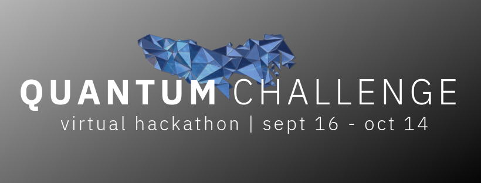

# Welcome to IBM Quantum Challenge!
[日本語はこちら](#ibm-quantum-challengeへようこそ)<br/>
First of all, thank you for taking interest in this challenge and for signing up for the competition. 
Before you get started, we have a few important notices to remind you.

## Registration
If you have not gone through the registration process yet, please make sure to go to the IBM Quantum Challenge [Official Website](https://quantumchallenge19.com/) and complete this [Registration Form](https://angelhack.typeform.com/to/UA44d9) before you get started. You won't be permitted to participate & win prizes without completing the registration!

The challenge period goes on for four weeks from September 16th to October 14th, 2019. The first three weeks will be a series of learning challenges during which anyone who is eligible may register to join the competition. Registration closes when the final challenge starts on October 7th, 2019.

So, assuming you are all set, let's get started!

## Installation
In IBM Quantum Challenge, you will need to code with **Qiskit**. Qiskit is a Python based opensource framework for working with quantum computers at the level of pulses, circuits, and algorithms. Please see the [Qiskit.org](https://qiskit.org) page for more details.

Qiskit can be installed by using *pip*:

```
$ pip install qiskit
```

Please check out [Install Qiskit](https://qiskit.org/documentation/install.html) or watch this [YouTube video](https://www.youtube.com/watch?v=M4EkW4VwhcI) for a step by step installaion guide.

## Challenge Index
We will upload the challenge content each week on the following dates.<br/>

| Week  | Challenge | Scheduled Update Date  |
| ---     | ---    | --- |
| Week 1  |[Learning Challenge Exercise I](https://github.com/quantum-challenge/2019/blob/master/problems/week1/week1_en.ipynb)  | Sept 16th, 2019 |
| Week 2  |Learning Challenge Exercise II | Sept 23rd, 2019 |
| Week 3  |Learning Challenge Exercise III| Sept 30th, 2019 |
| Week 4  |Final Challenge| Oct 7th, 2019 |


--------------------------------
# IBM Quantum Challengeへようこそ！
当チャレンジへのご参加ありがとうございます。
コンテストの参加にあたって、いくつか重要なお知らせがありますので、必ずご確認ください。

## 参加登録
[公式サイト](https://quantumchallenge19.com/)からの参加登録がまだお済みでない方は、必ずコンテストに取りかかる前に[参加登録](https://angelhack.typeform.com/to/UA44d9)の完了をお願いいたします。登録が完了していない場合は、参加の権利、および入賞時のアワード取得ができませんのでご注意ください。

IBM Quantum Challengeは2019年9月16日〜10月14日の4週間が開催期間です。最終週の本戦開始までは、ラーニングチャレンジと呼ばれる演習問題を毎週公開します。この期間中はどなたでも途中から参加登録が可能です。10月7日の本戦開始とともに登録の受付を終了いたします。

上記お済みでしたら、早速インストールからはじめて参りましょう！

## インストール方法
Quantum Challengeでは、**Qiskit** を使ってプログラムを作成します。Qiskitは量子コンピューターを使うためのPythonのオープンソース フレームワークです。パルスや回路、アルゴリズムといった様々なレイヤーで活用することができます。Qiskitの詳細は[Qiskit.org](https://qiskit.org)のページを参照して下さい。

Qiskitは *pip* を用いてインストールできます。

```
$ pip install qiskit
```
インストールの詳細な手順については[Qiskitのインストール](https://qiskit.org/documentation/locale/ja/install.html)または[インストール動画](https://www.youtube.com/watch?v=M4EkW4VwhcI)を参照してください。

## チャレンジ内容
毎週以下の日付にそれぞれのチャレンジ内容を更新します。<br/>

| ステージ  | チャレンジ | 更新予定日 |
| ---     | ---    | --- |
| Week 1  |[ラーニングチャレンジ演習 I](https://github.com/quantum-challenge/2019/blob/master/problems/week1/week1.ipynb) | Sept 16th, 2019 |
| Week 2  |ラーニングチャレンジ演習 II | Sept 23rd, 2019 |
| Week 3  |ラーニングチャレンジ演習 III| Sept 30th, 2019 |
| Week 4  |ファイナルチャレンジ(本戦) | Oct 7th, 2019 |
